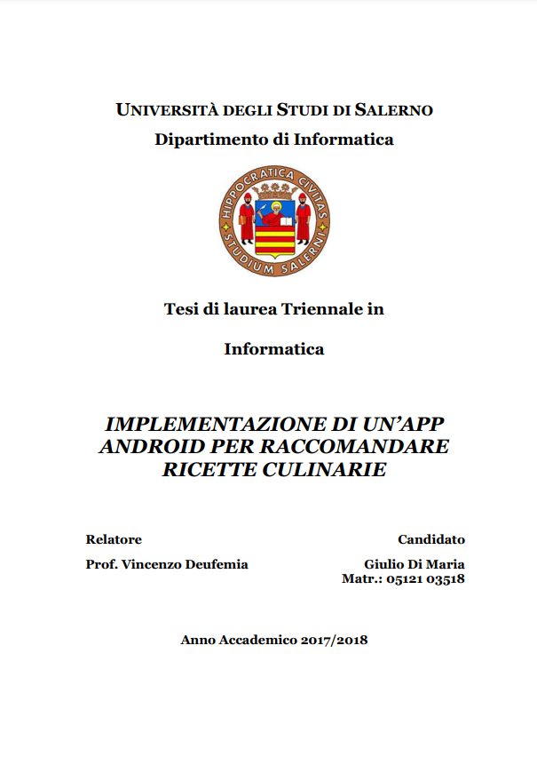

# RecipesAdviser
An Italian recipe adviser __Android APP__ with homemade AI collaborative algorithms to suggest the meal you wish. Suggestions are based on a selection of ingredients from the user. A further funnel filter elaborates his preferences and those of users like him to provide the best possible choise.

Thesis [TESI-DiMaria.pdf](Thesis/TESI-DiMaria.pdf):

    

All recipes and related information were downloaded from the [Giallo Zafferano website](https://www.giallozafferano.it/) via Web scraping. All data used belongs to © 2019 Mondadori Media S.p.A.

